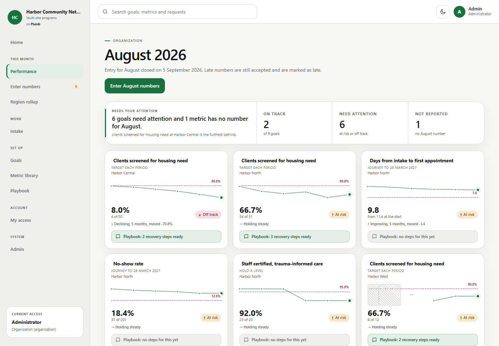
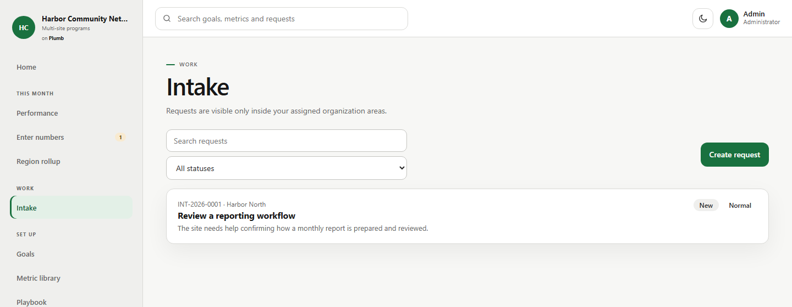
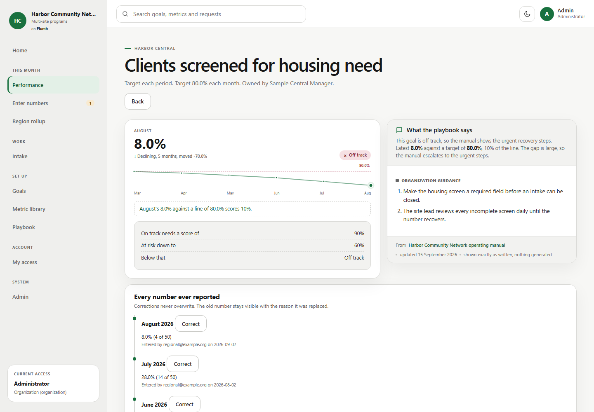
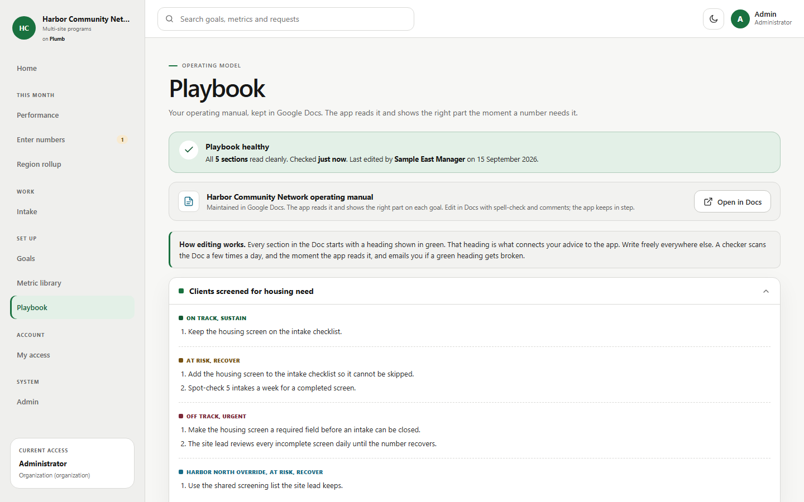

# Plumb

Plumb is an experimental internal operations application for Google Workspace.
It brings work requests, performance measures, and operating guidance into one interface, with Google Sheets storing records and Google Docs holding maintained procedures.
Each installation runs inside a single organization's Workspace.

**Status: experimental foundation, for synthetic-data testing only.**
Local tests simulate Google services.
Real Google identity, permissions, quotas, email delivery, concurrent edits, and restoration have not yet been qualified.
This version is not ready for production use or customer installation.

## What exists

- Work intake and status tracking with server-side permissions.
- Performance measures, goals, monthly entries, and correction history.
- Operating guidance drawn from maintained documents.
- Recoverable writes, duplicate submission handling, and uncertain-save recovery.
- Notification queues and logical backup/restore tools.

Customer/contact relationships, tracked improvement actions, final import tools, and a complete template package remain planned.
See the [roadmap](docs/roadmap.md) and [product specification](docs/product-contract.md).

## Screenshots

These captures show the current application running locally with synthetic records for the fictional Harbor Community Network.
Google Sheets, Docs, identity, and email are simulated in this demonstration; the images do not represent a qualified Google Workspace installation.

### Performance at a glance

See monthly results, targets, missing numbers, and goals that need attention across sites.



### Work intake

Search and filter requests, then open a record or create a new request for an assigned site.



### Goal detail and guidance

Compare a result with its target, review reporting history, and read the operating guidance associated with the current status.



### Operating playbook

Review maintained guidance by metric and status, including site-specific instructions.
The local demonstration uses a simulated document; live document access and notifications still require Google qualification.



## Run locally

Use Node.js 22.13 or later and npm.
Install the locked development dependencies:

```sh
npm ci --ignore-scripts
npx playwright install chromium
npm run verify
npm run demo
```

Open http://127.0.0.1:8790 for the local demonstration.
It uses synthetic records and simulated Google services.
The emulator permits test identity switching and must remain on localhost; do not host it publicly or use real data.
Browser installation downloads Chromium and requires network access.

## Explore the project

| Directory | Contents |
| --- | --- |
| `app/` | Apps Script server and HTML interface |
| `tests/` | Local service simulations, regression checks, and browser tests |
| `templates/` | Draft templates and specifications; not provisioned Google assets |
| `tools/` | Local candidate packaging |
| `docs/` | Installation, qualification, product boundaries, and security limitations |

See [verification](docs/foundation-results.md), [security](SECURITY.md), [test installation](docs/test-installation.md), and [Google qualification](docs/google-test-plan.md).

## Ownership and costs

The intended delivery model is a customer-owned installation with separately scoped setup and customization services.
There is no shared customer database or subscription enforcement in the application.
Google Workspace accounts and any additional services have their own costs and requirements.
A customer-owned deployment does not eliminate ongoing administration, backups, or maintenance.

## License

No open-source license is granted at this time.
Public availability is for inspection and evaluation of the project; it is not a general license to redistribute or sell it.
Third-party dependencies retain their own licenses.
